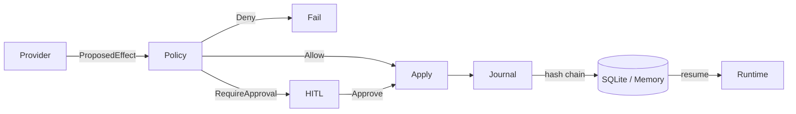

# AgentOS

**A durable agent runtime for people who refuse to ship flaky loops.**

AgentOS is an Apache-2.0 **Rust** workspace where every side effect is proposed, policy-checked, optionally human-approved, applied, and recorded on a **hash-chained journal**—so a killed process can **resume** instead of gaslighting you.

[](https://github.com/new-world-coder/agentos/actions/workflows/ci.yml)
[](LICENSE)
[](rust-toolchain.toml)
[](https://github.com/new-world-coder/agentos/releases)

> **The oasis idea:** the agent ecosystem is a desert of prompt spaghetti, silent tool calls, and “it worked on my laptop” demos. AgentOS is building an **oasis**—durable execution, auditable journals, and policy that actually runs *before* the effect. Join the movement: [VISION.md](VISION.md) · [good first issues](docs/GOOD_FIRST_ISSUES.md) · [Contributing](CONTRIBUTING.md)

---

## Why engineers care

| Usual agent loop | AgentOS |
|------------------|---------|
| State dies with the process | SQLite-backed runs + crash-resume |
| “Please don’t do bad things” in the system prompt | **Policy-before-effect** in-process |
| Mystery side effects | Append-only **effect journal** + SHA-256 chain |
| HITL as a Slack hack | First-class `awaiting_approval` status |
| One giant Python file | Clear Rust crates you can embed |

Honest scope: **Phase 0 + Phase 1 are done** (`v0.1.0` / Phase 1 complete). Real model providers, multi-node workers, and a full control plane are **later**—see [LIFECYCLE.md](LIFECYCLE.md). We advertise what we ship.

---

## 60-second start

```bash
git clone https://github.com/new-world-coder/agentos.git
cd agentos
cargo run -p agentos-cli -- doctor

# Durable run (survives process death)
cargo run -p agentos-cli -- --db ./agentos.db run "say hello"
cargo run -p agentos-cli -- --db ./agentos.db resume <run_id>

# HTTP API
cargo run -p agentos-api -- --db ./agentos.db --bind 127.0.0.1:8080
curl -s localhost:8080/health
```

```bash
cargo test --workspace
cargo clippy --workspace --all-targets -- -D warnings
```

---

## Architecture (one picture)



**Invariant:** no tool runs until policy (or a human) allows it. Every lifecycle event is journaled; resume verifies the chain first.

Deeper dive: [docs/ARCHITECTURE.md](docs/ARCHITECTURE.md) · ADRs in [docs/adr/](docs/adr/)

---

## Workspace

| Crate | Role |
|-------|------|
| `agentos-core` | Runs, effects, journal, hash chain |
| `agentos-store` | `Store` trait · memory + **SQLite** |
| `agentos-provider` | Provider trait · **mock** LLM |
| `agentos-tools` | Tool registry (`echo`, `add`, …) |
| `agentos-policy` | Allow / deny / require-approval |
| `agentos-runtime` | Propose → policy → HITL → apply |
| `agentos-api` | Axum HTTP (`/v1/runs`, drive, resume, approve) |
| `agentos-cli` | `doctor`, `run`, `resume`, `approve`, … |

---

## Contribute — grow the oasis

We want systems engineers, Rustaceans, and agent-infra folks—not drive-by README edits alone.

1. Read [VISION.md](VISION.md) (the movement) and [LIFECYCLE.md](LIFECYCLE.md) (what’s honest).
2. Pick a [good first issue](docs/GOOD_FIRST_ISSUES.md) or open a discussion issue.
3. Follow [CONTRIBUTING.md](CONTRIBUTING.md) · [CODE_OF_CONDUCT.md](CODE_OF_CONDUCT.md) · [GOVERNANCE.md](GOVERNANCE.md).

**High-leverage Phase 2 help:** real `Provider` adapters, richer tools + schemas, streaming, stronger policy profiles. See lifecycle Phase 2+.

---

## Repo “About” (GitHub UI)

This token can’t edit GitHub **Description / Topics** from CI. Maintainers: paste from [`.github/repository-meta.md`](.github/repository-meta.md) into **Settings → General → About** (takes ~30 seconds).

---

## License

[Apache-2.0](LICENSE) — use it, embed it, fork it, build on it.
