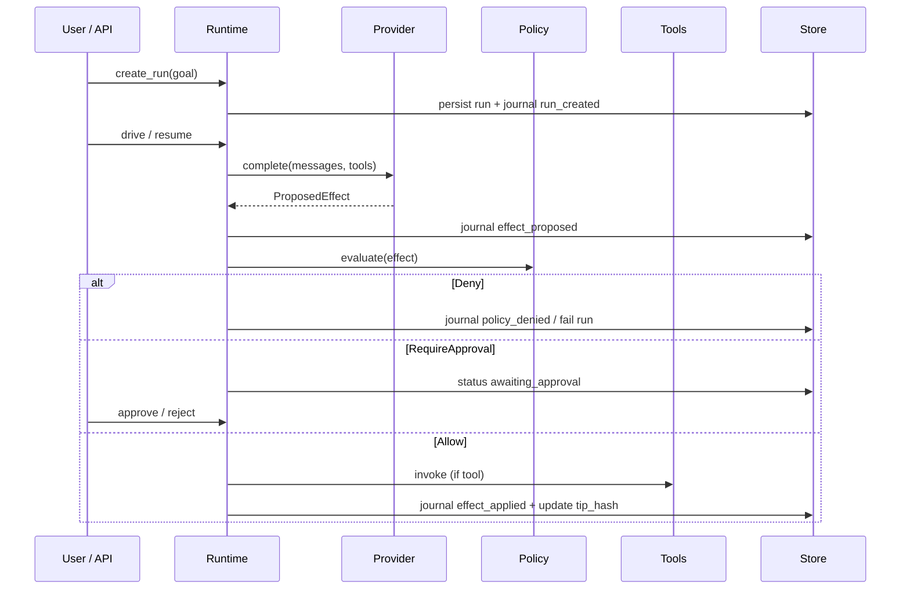

# Architecture

Oasis separates **proposal**, **authorization**, **application**, and **durability**.

## Control flow



## Hash chain

Each `JournalEntry` hashes a canonical record including `prev_hash`. Stores reject
mismatched `seq` / `prev_hash`. `Runtime::resume` calls `verify_chain` before continuing.

## Crate dependency direction

```text
cli / api
    ↓
runtime → policy, provider, tools, store
    ↓
core
```

Edges never depend on each other. Swapping SQLite for another `Store` should not
require changing policy or providers.

## Related ADRs

- [0001 Rust workspace](adr/0001-rust-workspace.md)
- [0002 Effect journal](adr/0002-effect-journal.md)
- [0003 Policy before effect](adr/0003-policy-before-effect.md)
- [0004 SQLite store](adr/0004-sqlite-store.md)
